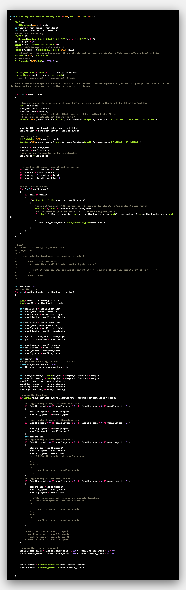

Another soul-breaking project is what this was, albeit fun & rewarding!

I felt limited by making everything in literal WINDOWS, and wanted to test out more of the capabilities besides it. I know the three different kind of Windows that can be created in CreateWindowsEx are WS_POPUP, WS_OVERLAPPED and WS_CHILD.

Wanted to make something that didn't have a close/minimize/x button for once. 

Then we wound up getting this!

I was very lucky to even have transparent text behind a window showing up in the WS_POPUP, but this did the trick

BLENDFUNCTION blend = {0};
blend.BlendOp = AC_SRC_OVER;
blend.SourceConstantAlpha = 255;
blend.AlphaFormat = AC_SRC_ALPHA;
SIZE sizeWnd = {width, height};
//ptpox & ptsrc in the center
POINT ptPos = {(GetSystemMetrics(SM_CXSCREEN) - width) / 2, (GetSystemMetrics(SM_CYSCREEN) - height) / 2};
POINT ptSrc = {0, 0};
UpdateLayeredWindow(hWnd, hDC, &ptPos, &sizeWnd, hCDC, &ptSrc, 0, &blend, ULW_ALPHA);

For collision detection, we had this 

BOOL did_rects_collide(RECT word1, RECT word2)
{
    if (word1.left < word2.right && word1.right > word2.left && word1.top < word2.bottom && word1.bottom > word2.top)
    {
        return true;
    }
    return false;
}

It is absolutely NOT the greatest physics in the world after the collision is detected, I was just playing around. I had to mess around with some weights to get ideal physics going, as we had some mishaps. Some of the collisions kept on sticking to each other. I'm just glad the words aren't overlapping, LOL, and that there's some semblance of interaction.

Some of the collisions are sticking to each other because the angles insist on remaining the same throughout, which they do. It is possible that I can change this in the future if it's that important via trigonometry, but that wasn't the primary purpose of doing this (yet)

Note a video link below.

!(FULL YOUTUBE VIDEO HERE IF INTERESTED)[https://www.youtube.com/watch?v=o-BrqI63vDg&t=14s]

One bug I faced was that the words were jittering back and forth when touching. That's because collisions were recording like "Word 2, Word 7" and "Word 7, Word 2". To overcome this challenge, I changed to search for the existence of a reverse pair in the vector before adding it, in the "add_transparent_text_to_desktop()" function where most of this happens. I don't see a major run-time cost given these vectors in collisions only had 2 to 5 entries at most.

Bouncing off of each other DOES happen when the words are coming at each other in the opposites. (they collide then go opposites, when both come at each other)

In cases where words are going in the same direction but one catches up to each other, the speeds of the two words transpose. 

By the time you read this, this might be improved. But I just wanted the words on a screen moving, the collision & changing of color when they touch is mere a bonus.

The full code is above and on GitHub, and I'll post the function for the "adding the transparent text" here:

